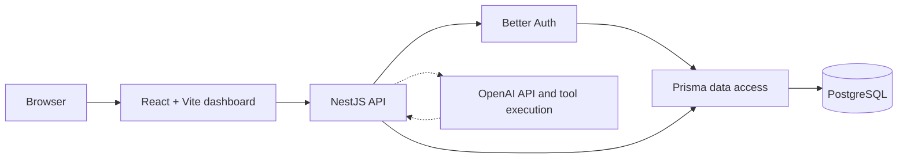

# Micro SaaS

[](https://github.com/arturopt25/micro-saas/actions/workflows/ci.yml)
[](LICENSE)
[](https://www.typescriptlang.org/)
[](https://turbo.build/repo)
[](https://nestjs.com/)
[](https://react.dev/)
[](https://www.prisma.io/)

> An AI-ready, multi-tenant operations platform for property management workflows, built as a production-minded TypeScript monorepo.

## Overview

Micro SaaS is a full-stack platform foundation for organizations that need to manage properties, tenants, applications, payments, and day-to-day operations from a single workspace. It combines tenant-aware domain boundaries with a modern React dashboard and a NestJS API designed to support validated AI tooling as the product evolves.

The project focuses on the engineering foundations that make a SaaS product maintainable at scale: explicit workspace isolation, role-based access, shared contracts, database migrations, reusable UI primitives, and automated quality checks.

### Key Features

- 🏢 **Multi-tenant workspaces:** Owner and tenant roles with workspace membership boundaries.
- 🔐 **Flexible authentication:** Email/password authentication with Better Auth and optional GitHub and Google providers.
- 🏘️ **Property catalog:** Manage buildings, apartments, residences, and houses with availability states.
- 📝 **Tenant applications:** Browse available units, submit applications, and review them as an owner.
- 💳 **Payment workflows:** Submit tenant payments for owner review with approval and rejection states.
- 🛠️ **Operations dashboard:** Domain surfaces for maintenance, fines, parking, tenants, and property operations.
- 🌎 **Localized experience:** English and Spanish translations with persisted language preferences.
- 🌓 **Theme preferences:** Light and dark modes persisted locally and in the user profile.
- 🤖 **AI-ready backend:** OpenAI integration boundaries and validated agent contracts prepared for tenant-scoped automation.
- ✅ **Automated quality:** Shared linting, typechecking, testing, and builds orchestrated by Turborepo and GitHub Actions.

> [!NOTE]
> The repository is under active development. Core authentication, tenant, property, application, payment, and preference flows are implemented. AI agent execution, real-time progress streaming, and broader workflow automation remain part of the product roadmap.

## Architecture

### Monorepo Structure

```text
micro-saas/
├── apps/
│   ├── api/                    # NestJS HTTP API and bounded feature modules
│   └── web/                    # React + Vite dashboard application
├── packages/
│   ├── config/                 # Shared TypeScript configuration
│   ├── db/                     # Prisma schema, migrations, and database client
│   ├── shared-types/           # Shared Zod schemas and TypeScript contracts
│   └── ui/                     # Reusable Mantine-based UI primitives
├── docs/
│   └── architecture.md         # System boundaries and planned modules
├── docker-compose.yml          # Local PostgreSQL service
├── pnpm-workspace.yaml         # Workspace packages and dependency catalog
└── turbo.json                  # Task pipeline and caching configuration
```

### System Flow



The API resolves the authenticated user and workspace context at the request boundary. Services then apply role and tenant filters before reading or writing domain data. Shared Zod schemas provide a common validation contract between the API and frontend packages.

The OpenAI connection is represented as an integration boundary for the planned agent runner. Future tool execution will validate inputs, enforce tenant scope, persist auditable runs and events, and expose progress to clients.

### Technical Decisions

| Decision                 | Rationale                                                                                                                          |
| ------------------------ | ---------------------------------------------------------------------------------------------------------------------------------- |
| **NestJS**               | Encourages explicit modules, dependency injection, request pipelines, and clear bounded contexts as the API grows.                 |
| **React + Vite**         | Provides a fast, type-safe frontend development loop with a small and flexible production bundle.                                  |
| **Mantine UI**           | Delivers accessible, composable primitives while keeping the visual system centralized and consistent.                             |
| **TanStack Query**       | Provides a scalable foundation for server-state caching, invalidation, and request lifecycle management as dashboard data expands. |
| **Prisma**               | Offers type-safe PostgreSQL access, declarative schema management, and reviewable migrations.                                      |
| **pnpm + Turborepo**     | Enables workspace-level dependency reuse and fast, dependency-aware task orchestration.                                            |
| **Shared Zod contracts** | Keeps external input validation explicit and aligns runtime validation with TypeScript types.                                      |

For a deeper explanation of service boundaries and planned modules, see [`docs/architecture.md`](docs/architecture.md).

## Technology Stack

| Area                 | Technologies                                                                                         |
| -------------------- | ---------------------------------------------------------------------------------------------------- |
| **Frontend**         | React 19, Vite, TypeScript, Mantine UI, TanStack Query, TanStack Router, Recharts, i18next           |
| **Backend**          | NestJS, Express, Better Auth, Zod, class-validator                                                   |
| **Database**         | PostgreSQL 17, Prisma 6                                                                              |
| **Auth & AI**        | Better Auth, email/password auth, GitHub and Google OAuth configuration, OpenAI API tooling boundary |
| **DevOps & Tooling** | pnpm workspaces, Turborepo, Docker, Docker Compose, GitHub Actions, ESLint, Prettier, Vitest         |

## Getting Started

### Prerequisites

- Node.js 24 or later
- pnpm 11.5.1 or later
- Docker and Docker Compose
- Git

The CI pipeline uses Node.js 24 and pnpm 11.5.1.

### Installation

1. Clone the repository and enter the project directory:

   ```bash
   git clone https://github.com/arturopt25/micro-saas.git
   cd micro-saas
   ```

2. Enable Corepack and install workspace dependencies:

   ```bash
   corepack enable
   pnpm install
   ```

3. Create the application environment files:

   ```bash
   cp apps/api/.env.example apps/api/.env
   cp apps/web/.env.example apps/web/.env
   ```

4. Review the values in both `.env` files. At minimum, configure a 32-character `BETTER_AUTH_SECRET` in `apps/api/.env`. OAuth credentials and `OPENAI_API_KEY` are optional for the current local flows.

5. Start PostgreSQL with Docker Compose:

   ```bash
   docker compose up -d postgres
   ```

6. Generate the Prisma client and apply local migrations:

   ```bash
   pnpm db:generate
   pnpm db:migrate
   ```

7. Start the frontend and API in development mode:

   ```bash
   pnpm dev
   ```

The web application is available at `http://localhost:5173` and the API at `http://localhost:3000`.

### Environment Variables

| File            | Variable                                   | Purpose                                   |
| --------------- | ------------------------------------------ | ----------------------------------------- |
| `apps/api/.env` | `DATABASE_URL`                             | PostgreSQL connection string              |
| `apps/api/.env` | `BETTER_AUTH_SECRET`                       | Session and authentication secret         |
| `apps/api/.env` | `BETTER_AUTH_URL`                          | Public base URL for Better Auth           |
| `apps/api/.env` | `WEB_URL`                                  | Allowed frontend origin                   |
| `apps/api/.env` | `GITHUB_CLIENT_ID`, `GITHUB_CLIENT_SECRET` | Optional GitHub OAuth credentials         |
| `apps/api/.env` | `GOOGLE_CLIENT_ID`, `GOOGLE_CLIENT_SECRET` | Optional Google OAuth credentials         |
| `apps/api/.env` | `OPENAI_API_KEY`                           | Reserved for OpenAI-powered tooling       |
| `apps/web/.env` | `VITE_API_URL`                             | API base URL used by the frontend         |
| `apps/web/.env` | `VITE_BETTER_AUTH_URL`                     | Better Auth base URL used by the frontend |

> [!TIP]
> Use `pnpm db:studio` to inspect the local PostgreSQL database through Prisma Studio.

## Code Quality and Testing

All root-level quality commands are routed through Turborepo:

```bash
pnpm lint             # Run ESLint across workspaces
pnpm typecheck        # Validate TypeScript across workspaces
pnpm test             # Run unit and component tests
pnpm build            # Build all applications and packages
pnpm format:check     # Verify Prettier formatting
```

The same lint, typecheck, test, and build sequence runs in [`ci.yml`](.github/workflows/ci.yml) for pushes to `main` and pull requests.

## Roadmap

- [ ] Complete the OpenAI agent runner with validated, auditable, tenant-scoped tools.
- [ ] Persist agent runs and events and expose progress through Server-Sent Events.
- [ ] Standardize frontend server-state caching and invalidation with TanStack Query.
- [ ] Add Redis for caching, distributed rate limiting, and short-lived workflow state.
- [ ] Introduce WebSockets for real-time operation and automation status updates.
- [ ] Add background job processing for long-running workflows and notifications.
- [ ] Expand CI/CD with deployment pipelines, preview environments, and release automation.
- [ ] Add OpenTelemetry tracing, structured metrics, and centralized error monitoring.
- [ ] Increase integration and end-to-end test coverage for tenant isolation and role boundaries.

## License

Distributed under the MIT License. See [`LICENSE`](LICENSE) for more information.
